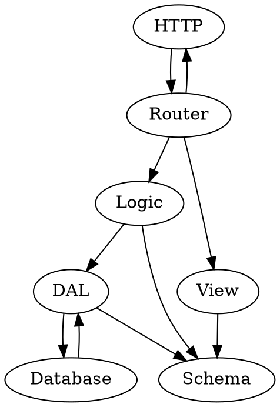

+++
title = "enterprise: Strawman Proposal"
draft = true

[taxonomies]
categories = ["post"]
tags = ["enterprise", "rust"]

[extra]
# comment_issue = 3
+++

A friend ([Michael Zhang](https://iptq.io/)) and I may be working on a web framework for Rust, [`enterprise`](https://crates.io/crates/enterprise). This post serves as a strawman proposal for this framework, and as documentation for what the framework may eventually be.

Also note that despite the authorial "we," this is almost entirely my vision (hence the S-expressions, use of Prolog, etc.), so expect this to be a strawman that's lit aflame rather than fortified.

Introduction
============

The model we use for webapps is described by the diagram:



Many names here, and general inspiration, are taken from [Ted Kaminski's "Stateless MVC."](https://www.tedinski.com/2018/09/11/stateless-mvc.html)

Backend
=======

Middleware
==========

Auth
----

The generic phrase "auth" confusingly can refer to either "authentication" or "authorization." These are conflated both by the term and in many people's heads, so we avoid it, and make a strong split between the two.

### Authentication

Authentication is the answer to the question "what user does this request correspond to?" As with other parts of a web application, `enterprise` simplifies authentication by abstracting it heavily.

For our app, we want to allow a plethora of authentication methods, while also allowing a user to have multiple authentication methods. (This is useful since a user might forget whether they registered with their Google account or email, and it allows an anonymous user to add an email and stop being anonymous!)

In `app.sexp`:

```
(authentication
  (multiple true)
  (providers
    anonymous-cookie
    (email-password :reset email)
    oauth-facebook
    oauth-google
    oauth-twitter))
```

In **views/login.sexp**:

```
TODO
```

### Authorization

Authorization is the answer to the question "can this user perform this action?" This is almost entirely application-specific, so we leave the logic here to the app author.

But wait, we're using logic on a question with a boolean answer? Well, I know the best way to do this! `enterprise` apps specify authorization information with a Prolog dialect.

For our app, TODO.

In `src/authorization.pro`:

```pro
authorized(UserID, Action). # TODO
```

Frontend
========
