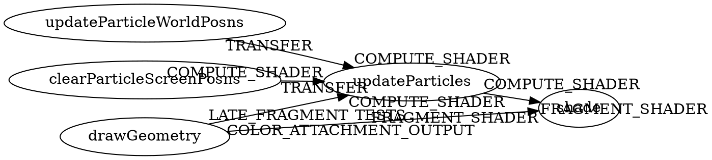

+++
title = "Notebook: Vulkan"

[taxonomies]
tags = ["vulkan"]
+++

nova
====

goal:

-	type-safe
-	sync-safe
-	raii

Example
-------

API
---

`Device : *`

-	`new_device : Target t => t -o Device`

`Cmd : * -> *`

-	`run : Device -> Cmd a -o a`

`CmdBufUsage : *`

-	`OneTimeSubmit : CmdBufUsage`
-	`Reusable : CmdBufUsage`

`CmdBuf : CmdBufTypeState -> *`

-	`submit : CmdBuf (Executable t) -o CmdBuf (Pending t)`
-	`waitComplete : CmdBuf (Pending Reusable) -o CmdBuf (Executable Reusable)`
-	`waitCompleteOne : CmdBuf (Pending OneTimeSubmit) -o CmdBuf Invalid`

`Image : *`

-	`create : Device -> Image`
-	`destroy : Image -o ()`
